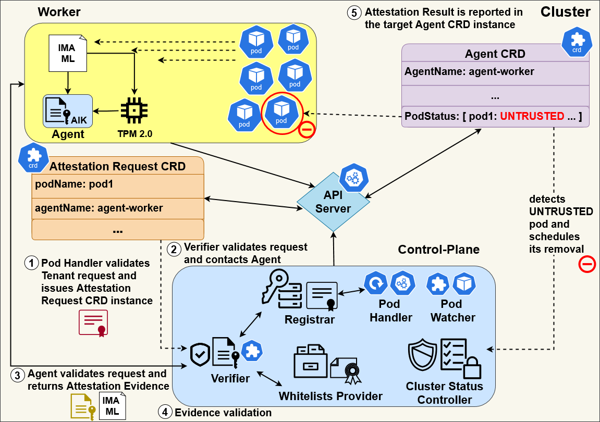

# Kubernets Pods Remote Attestation 

## Overview
**Remote Attestation** architecture integrated within **Kubernetes** framework to provide **hardware-based integrity verification and validation** capabilities over **pods** running in the cluster, leveraging the **Root of Trust (RoT)** provided by Worker nodes' **Trusted Platform Module (TPM)**.

